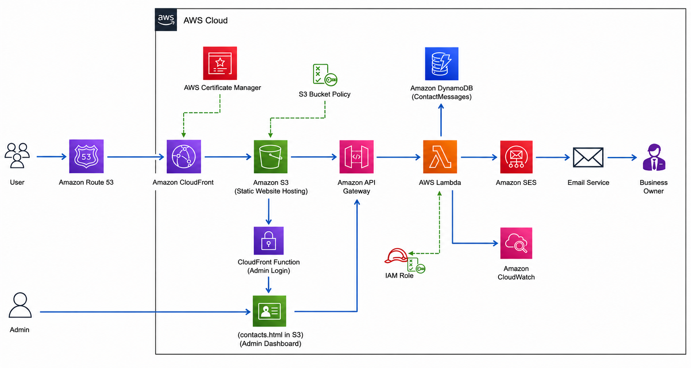
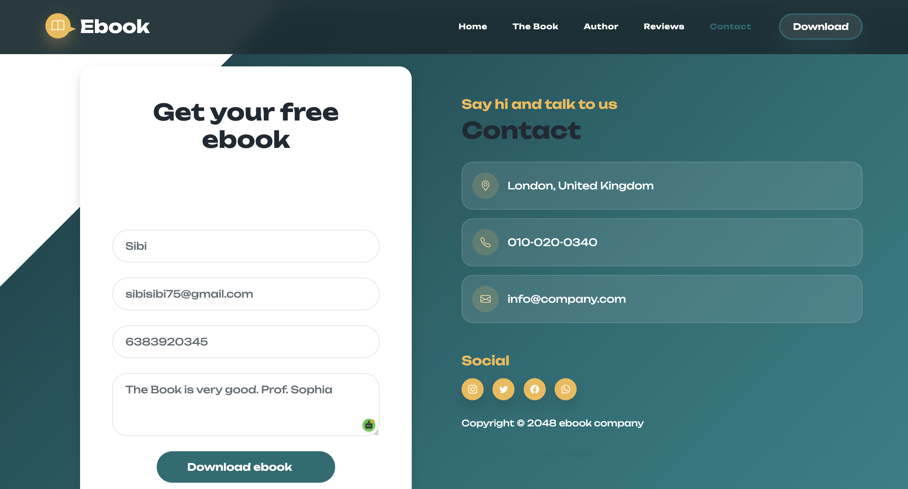
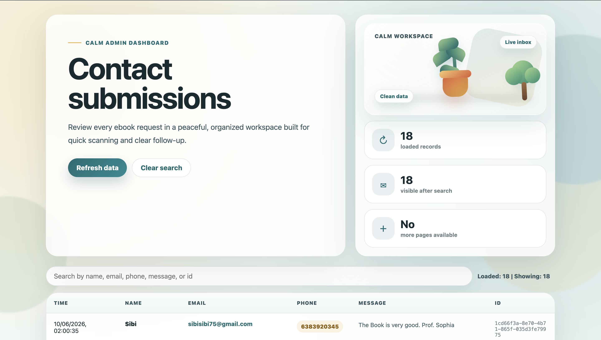
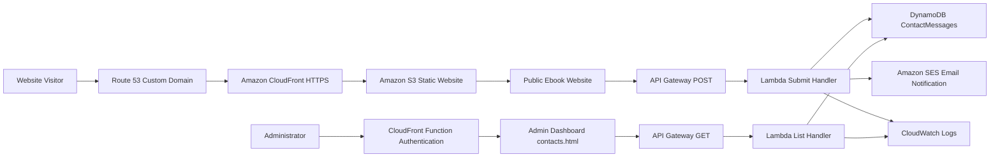

# AWS Serverless Ebook Lead Management Platform


A fully serverless lead generation and contact management platform built on AWS.

This project allows visitors to download an ebook from a public website while automatically capturing lead information, storing contact records in Amazon DynamoDB, and sending email notifications through Amazon SES.

To simplify lead management, a protected admin dashboard was developed to help administrators view submitted contact requests in near real time.

The solution was designed with a serverless architecture to provide scalability, security, high availability, and minimal operational overhead.

---

## Live Demo

### Public Website

[https://ebook.sanjaysoft.com](https://ebook.sanjaysoft.com)

### Admin Dashboard

[https://ebook.sanjaysoft.com/contacts.html](https://ebook.sanjaysoft.com/contacts.html)

---

## Architecture Overview



---

## Project Screenshots

### Public Ebook Website

The public website is the entry point for users requesting the ebook. Visitors submit their name, email, phone number, and message through the download form.



### Admin Dashboard

The admin dashboard displays submitted contact requests from DynamoDB and supports viewing lead details in a clean, responsive interface.



---

## Business Problem

Many businesses use free ebooks to generate leads, but managing requests manually through spreadsheets, emails, or shared documents becomes inefficient as traffic grows.

This project automates the complete lead management process by:

- Capturing visitor contact information
- Storing leads in a managed NoSQL database
- Sending automated email notifications
- Providing a centralized admin dashboard
- Reducing manual lead tracking effort
- Improving response time for new customer inquiries

---

## Solution Summary

The platform uses AWS managed services to deliver a secure, scalable, and event-driven lead management workflow.

1. Users visit the public ebook website through a custom domain.
2. Amazon CloudFront delivers the static website securely over HTTPS.
3. Static files are hosted in Amazon S3.
4. Users submit the ebook download form.
5. Amazon API Gateway receives the form request.
6. AWS Lambda processes the submitted data.
7. Lambda stores contact records in Amazon DynamoDB.
8. Lambda sends email notifications using Amazon SES.
9. Amazon CloudWatch captures logs for monitoring and troubleshooting.
10. Administrators open the protected dashboard to view submitted records.
11. The dashboard calls a GET API to retrieve records from DynamoDB.

---

## Architecture Flow



---

## AWS Services Used

| Service | Purpose |
|---|---|
| Amazon Route 53 | Custom domain DNS management |
| Amazon CloudFront | Global content delivery, HTTPS access, and admin protection |
| AWS Certificate Manager | SSL/TLS certificate for secure HTTPS traffic |
| Amazon S3 | Static hosting for the public website and admin page |
| Amazon API Gateway | REST API endpoints for form submission and lead retrieval |
| AWS Lambda | Serverless backend logic for POST and GET workflows |
| Amazon DynamoDB | Managed NoSQL database for lead records |
| Amazon SES | Automated email notifications |
| Amazon CloudWatch | Logs, monitoring, and debugging |
| AWS IAM | Least-privilege access control for Lambda and AWS services |
| CloudFront Functions | Lightweight authentication for the admin dashboard |

---

## Key Features

- Public ebook landing page
- Contact form with name, email, phone, and message fields
- Serverless API integration
- DynamoDB lead storage
- Automated email notification through SES
- Admin dashboard for viewing submitted leads
- Pagination support using `limit` and `lastKey`
- CloudFront HTTPS delivery
- Custom domain configuration
- CloudWatch logging
- Fully managed, scalable backend
- Responsive design for desktop, tablet, and mobile

---

## Security Features

- HTTPS encryption using AWS Certificate Manager
- S3 content delivered through CloudFront
- IAM role-based permissions for Lambda
- DynamoDB permissions scoped through IAM policy
- CloudFront Function authentication for admin dashboard access
- CORS configured for API Gateway methods
- Admin dashboard separated from public landing page workflow

---

## DynamoDB Table Design

Table name:

```text
ContactMessages
```

Recommended key schema:

| Attribute | Type | Purpose |
|---|---|---|
| `id` | String | Unique lead record ID |

Stored item example:

```json
{
  "id": "uuid-value",
  "name": "Sanjay Kumar",
  "phone": "9876543210",
  "email": "user@example.com",
  "message": "I want to download the ebook.",
  "createdAt": "2026-06-10T10:30:00.000Z"
}
```

---

## API Endpoints

Base API:

```text
https://delgiwtcjl.execute-api.us-east-1.amazonaws.com/dev/epicreads_resource
```

| Method | Purpose |
|---|---|
| `POST` | Receives public website form submissions |
| `GET` | Reads contact records for the admin dashboard |
| `OPTIONS` | Handles CORS preflight requests |

GET query support:

```text
?limit=25
?lastKey=<pagination-token>
```

Expected GET response:

```json
{
  "items": [
    {
      "id": "uuid-value",
      "name": "Sanjay Kumar",
      "phone": "9876543210",
      "email": "user@example.com",
      "message": "I want to download the ebook.",
      "createdAt": "2026-06-10T10:30:00.000Z"
    }
  ],
  "lastKey": null
}
```

---

## Project Structure

```text
.
├── index.html
├── contacts.html
├── 404.html
├── README.md
├── architecture.png
├── Ebook.png
├── Admin.png
├── css/
│   ├── bootstrap.min.css
│   ├── bootstrap-icons.css
│   ├── templatemo-ebook-landing.css
│   └── premium-redesign.css
├── js/
│   ├── bootstrap.bundle.min.js
│   ├── click-scroll.js
│   ├── custom.js
│   ├── jquery.min.js
│   └── jquery.sticky.js
├── fonts/
└── images/
```

---

## Deployment Overview

### 1. Static Website Hosting

Upload the static website files to Amazon S3:

```text
index.html
contacts.html
404.html
css/
js/
fonts/
images/
architecture.png
Ebook.png
Admin.png
```

### 2. CloudFront Distribution

Configure CloudFront with:

- S3 bucket as origin
- HTTPS certificate from ACM
- Custom domain `ebook.sanjaysoft.com`
- Default root object `index.html`
- CloudFront Function authentication for `/contacts.html`

### 3. API Gateway

Create the following methods for `/epicreads_resource`:

```text
GET
POST
OPTIONS
```

Enable CORS for:

```text
Access-Control-Allow-Origin: *
Access-Control-Allow-Methods: GET,POST,OPTIONS
Access-Control-Allow-Headers: Content-Type,Authorization,X-Api-Key,X-Amz-Date,X-Amz-Security-Token
```

Also enable CORS for:

```text
Default 4XX
Default 5XX
```

### 4. Lambda Functions

Use one Lambda for form submissions and one Lambda for listing contact records.

Submit Lambda:

- Parses form data
- Saves record to DynamoDB
- Sends email notification with SES

List Lambda:

- Scans DynamoDB
- Sorts records by `createdAt` descending
- Supports pagination using `limit` and `lastKey`
- Returns `Cache-Control: no-store`

### 5. DynamoDB Permissions

Lambda execution role requires:

```text
dynamodb:PutItem
dynamodb:Scan
```

For email:

```text
ses:SendEmail
ses:SendRawEmail
```

---

## Testing Checklist

Use this checklist to verify the complete platform:

- [ ] Public website loads at `https://ebook.sanjaysoft.com`
- [ ] Ebook form submits successfully
- [ ] New record appears in DynamoDB `ContactMessages`
- [ ] Email notification is received through SES
- [ ] Admin dashboard loads at `https://ebook.sanjaysoft.com/contacts.html`
- [ ] Admin dashboard shows records from DynamoDB
- [ ] Refresh button retrieves latest data
- [ ] Load more button appears when `lastKey` is returned
- [ ] CloudWatch logs show Lambda execution details
- [ ] CloudFront invalidation completed after deployment

---

## Technical Skills Demonstrated

- AWS Serverless Architecture
- REST API Development
- Static Website Hosting
- CloudFront and CDN Configuration
- Custom Domain and HTTPS Setup
- DynamoDB Data Modeling
- Lambda Event Processing
- SES Email Automation
- IAM Permission Management
- CORS Configuration
- CloudWatch Monitoring
- Admin Dashboard Development
- Security-focused Cloud Deployment

---

## Business Value

This project demonstrates how a business can automate ebook lead collection without managing servers.

The platform improves lead management by:

- Reducing manual data entry
- Centralizing customer requests
- Providing fast access to lead records
- Automating email alerts
- Scaling automatically with traffic
- Reducing operational overhead through managed AWS services

---

## Future Improvements

- Amazon Cognito authentication for admin users
- Role-based admin access
- Lead export to CSV
- Lead status tracking
- Search and filter options in the admin dashboard
- Analytics dashboard for campaign performance
- Real-time notifications
- Integration with email marketing tools
- Infrastructure as Code using Terraform or AWS CDK

---

## Author

**Sanjay Kumar**

Master's Student - Information Management  
Chaoyang University of Technology, Taiwan

Fields of Interest:

```text
Cloud Computing | AWS | Artificial Intelligence | Machine Learning
```

---

## Project Status

```text
Status: Completed
Platform: AWS Serverless
Deployment: S3 + CloudFront + API Gateway + Lambda
Database: DynamoDB
Notifications: Amazon SES
```
